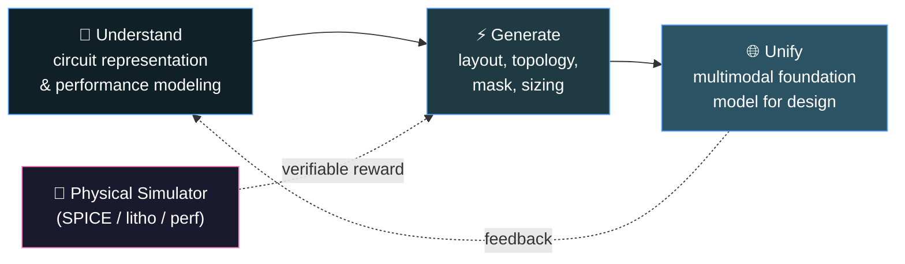

<div align="center">



<br/>

<a href="https://laiyao1.github.io"></a>
<a href="https://scholar.google.com/"></a>
<a href="https://www.linkedin.com/"></a>
<a href="mailto:your.email@cst.cam.ac.uk"></a>


</div>

---

## 🧭 About Me

```python
class YaoLai:
    def __init__(self):
        self.role      = "Postdoctoral Research Associate, University of Cambridge"
        self.education = ["PhD, The University of Hong Kong",
                          "Visiting Researcher, UT Austin"]
        self.field     = "AI for EDA / Design Automation for AI"
        self.thesis    = "Generative model + physical simulator = verifiable reward"

    def research_loop(self):
        while not solved("chip design"):
            yield "understand" -> "generate" -> "unify"
```

- 🔬 I build learning-based systems that design, verify, and predict silicon.
- 🧪 Current focus: open-source simulation for AI accelerators (ARIA *Scaling Compute*, AIxSIM).
- 🤖 Long game: a foundation model that reads a spec and returns a circuit.
- 📮 Always happy to talk about ML4EDA, analog agents, and RL with simulator feedback.

---

## 🧬 Research Map



---

## 📌 Selected Work

| Project | What it does | Venue |
|:--|:--|:--|
| **MaskPlace** | Fast chip macro placement with pixel-level visual representation | `NeurIPS` |
| **ChiPFormer** | Transferable placement via offline decision transformer | `ICML` |
| **AnalogCoder** | Training-free LLM agent that writes analog circuits | `AAAI` *Oral* |
| **AnalogCoder-Pro** | Unified generation and sizing for analog design | `IEEE TCAD` |
| **LithoGRPO** | Inverse lithography via GRPO-reinforced flow matching | `ICML` |

> Full list on my [homepage](https://laiyao1.github.io) and Google Scholar.

---

## 🛠️ Toolbox

<div align="center">


</div>

---

## 📊 GitHub Activity

<div align="center">


<br/><br/>


</div>

---

<div align="center">

*"Simulate before you fabricate."*

</div>
